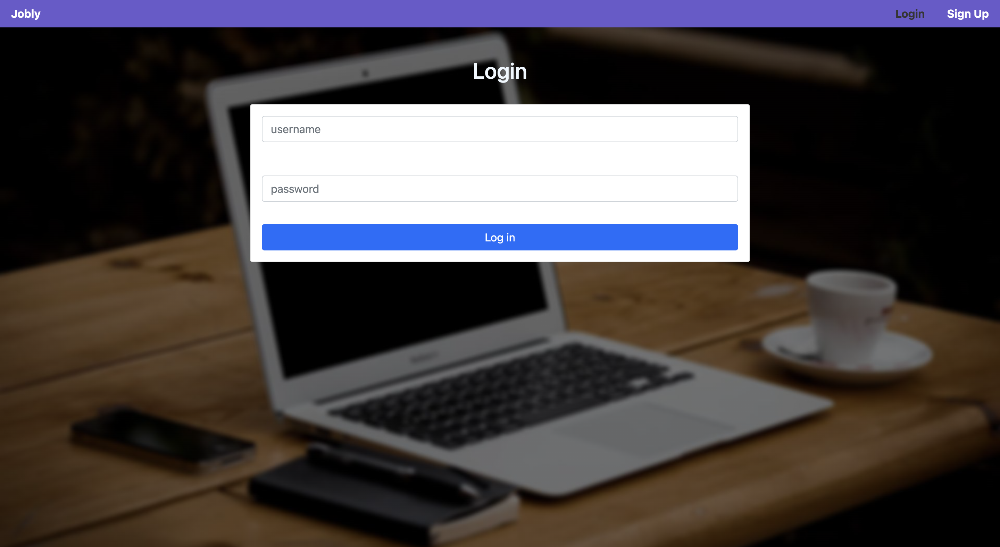
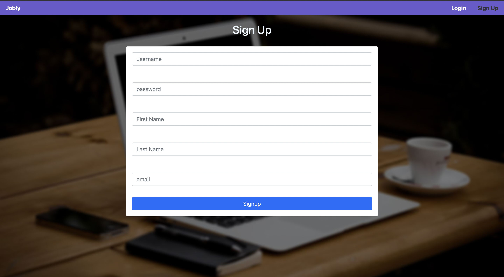
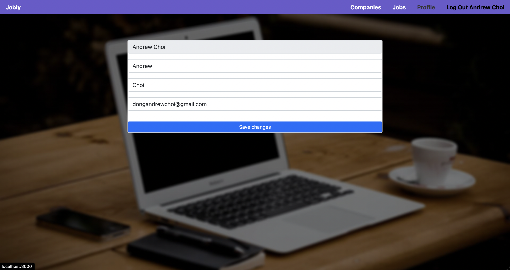

# Jobly

Jobly is a web-based job search application that utilizes React for the front-end, an Express RESTful API for the back-end, and a PostgreSQL database for data storage. The API provides full CRUD functionality for companies, jobs, and users, with the ability to filter by custom queries. Authentication and authorization are implemented using JSON Web Tokens (JWT) for secure access to protected resources on both the front-end and back-end.

### Home Page

### Log In
- Used one way hashing authenticating users and used useContext for user information throughout the application

### Sign Up
- Registered with hashed passwords to securely store them in the database

### Companies List
- Company State is decalred in the top level
- Company card can be clicked for detailed information and renders job components to show company's job postings

### Jobs List
- Using useContext for user info to show if they have previously applied to the job posting

### User Info Update
- Using Patch requests and JWT, we authN and authZ the request with JWT and 
Jobly is a web-based job search application that utilizes React for the front-end, an Express RESTful API for the back-end, and a PostgreSQL database for data storage. The API provides full CRUD functionality for companies, jobs, and users, with the ability to filter by custom queries. Authentication and authorization are implemented using JSON Web Tokens (JWT) for secure access to protected resources on both the front-end and back-end.

### Technologies
- React & React Router
- Axios
- Express
- JWT
- Bcrypt
- PostgreSQL
- Jest

_The backend code used in this application was provided by [Rithm School](https://www.rithmschool.com/), we built the backend as a separate exercise (code can be found [here](https://github.com/DongChoi/express-jobly)). Pair programmed with [Lynn Cha](https://github.com/lynecha) on this application._

## Available Routes

- /
- /login
- /signup
- /companies
- /companies/:handle
- /jobs
- /profile

## Main function controlling current user in app

1. Upon mounting, the application searches localStorage to retrieve any stored token to rehydrate the current user state.
2. If a token is found, it is utilized for subsequent API calls and the current user state and context is updated with information from the API. Additionally, the application interface is updated accordingly.
3. If no token is found, the login/signup buttons are displayed to prompt the user to authenticate themselves.

## Real Time query filtering

- As user types in the search bar, the company and job listings are updated.

# Instructions
1. To start using this app you first need to clone the repository:

   git clone git@github.com:DongChoi/jobly.git

2. In the command line, navigate into front-end and back-end folder 
   in two different tabs and enter the commands for the next two steps

3. To install dependencies - npm install

4. To start application - npm start
